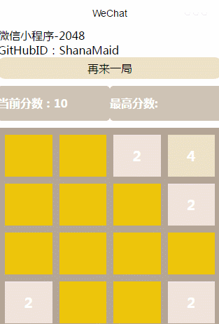

# wx-2048
微信小程序，还原游戏2048，目前实现部分功能

## 界面效果


## 使用方法
* Step 1 下载微信小程序开发者工具
[win64](https://servicewechat.com/wxa-dev-logic/download_redirect?type=x64&from=mpwiki)
[win32](https://servicewechat.com/wxa-dev-logic/download_redirect?type=ia32&from=mpwiki)
[mac](https://servicewechat.com/wxa-dev-logic/download_redirect?type=darwin&from=mpwiki)

* Step 2 下载本项目
```
git clone https://github.com/ShanaMaid/wx-2048.git
```

* Step 3 添加项目并运行

## 功能实现
- [x] 基本游戏功能
- [ ] 积分块移动动画 
- [x] 最高分数本地存储
- [ ] 算法优化

## 版本更新记录
v1.0.1 最高分数本地存储
v1.0.0 游戏基本功能实现

## License
see [MIT LICENSE](./LICENSE) for details
